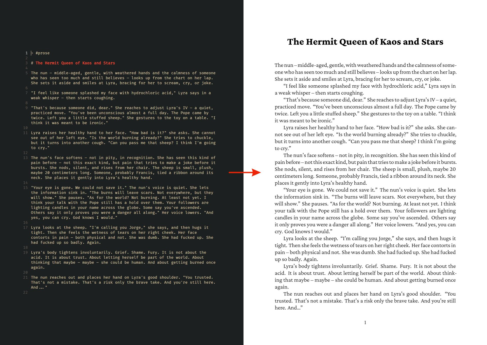

# md to epub/pdf

Node.js tool that converts markdown into EPUB and (optionally) PDF.

- EPUB is built with `markdown-it` + `jszip`.
- PDF is built with a custom markdown-to-TeX parser + `xelatex`.
- No pandoc is used.



## command

`make_books` reads markdown files from `SOURCE_PATH` in `./src/constants.js`.

You can override input dir per run:

```bash
MD_TO_EPUB_SOURCE_PATH="D:/notes/" npm run make_books
```

Available npm script:

- `make_books` - creates `.epub` and (if enabled) `.pdf` files in `./output`.

## settings

Settings live in `./src/constants.js`.

- `author` - default author.
- `publisher` - default publisher.
- `language` - default language (`en`, `pl`, etc.).
- `convertToPdf` - when `true`, runs `xelatex` and generates PDF.
- `filter` - decides whether a file is included.
- `parseGtAsProps` - enables metadata parsing from `>` lines and front matter.
- `addEmptyLines` - doubles line breaks to preserve manual pacing.
- `hyphenate` - adds soft hyphens for EPUB/HTML flow.
- `replaceSeparators` - normalizes separator lines and converts them to scene breaks.
- `stripCodeBlocks` - array of code languages to strip; `true` strips all fenced code blocks.
- `stripComments` - strips `%%comment%%` fragments.

### filter callback shape

`filter` receives:

- `params` - metadata object parsed from the file (or `{}` if `parseGtAsProps === false`).
- `fileName` - source file name (for example `chapter-01.md`).

Return `true` to include the file, `false` to skip it.

Example:

```js
filter: (params, fileName) => {
  if (fileName === 'diary.md') return true;
  if (params.skip) return false;
  const tags = params.tag?.split(/\s+/).filter(Boolean) ?? [];
  return tags.includes('prose') || tags.includes('article');
}
```

## metadata in source files

When `parseGtAsProps` is enabled, metadata can be provided in two formats:

- leading `>` lines
- YAML-like front matter (`--- ... ---`)

`>` example:

```md
> #prose
> language:: en
> story:: [[Little Cats]]
> order:: cats chapter 1
> author:: Jane Doe
> cover:: covers/little-cats.jpg
```

Parsed as plain strings:

```json
{
  "tag": "prose",
  "language": "en",
  "story": "[[Little Cats]]",
  "order": "cats chapter 1",
  "author": "Jane Doe",
  "cover": "covers/little-cats.jpg"
}
```

Grouping and ordering behavior:

- Same `story` value => grouped into one output book.
- Group sections are sorted by `order`, then file title.
- `author`, `publisher`, `language`, `cover` can override defaults.

## cover images

Set `cover` metadata in any chapter of a story/book:

```md
> cover:: covers/book-cover.jpg
```

How it works now:

- Path is resolved relative to `SOURCE_PATH`.
- The cover is copied into the EPUB package and added as a title page.
- The same cover is inserted at the beginning of the PDF.

Current constraints:

- EPUB manifest currently declares the cover as `image/jpeg`, so `.jpg/.jpeg` is the safe format.
- If multiple sections in one story set `cover`, the last one seen wins.

## markdown support (current reality)

### PDF path

Works well:

- headings (`#`, `##`, `###`, `####`)
- italics/bold (`*x*`, `**x**`, `__x__`, `***x***`)
- inline code and fenced code blocks (with Prism-based highlighting)
- unordered and ordered lists (simple structure)
- inline links in `[label](url)` form
- custom POV blocks: `<div class="pov">Name</div>`
- separators (`***`, also normalized from `---` and `___`)

Likely missing or brittle:

- markdown tables
- markdown images (``)
- blockquotes and many advanced markdown extensions
- reference-style links (`[x][id]`) and complex link edge cases
- deeply nested list structures

### EPUB path

Works well:

- standard markdown via `markdown-it` (headings, paragraphs, links, lists, code, etc.)
- typographic quotes via `markdown-it` typographer
- custom POV and separator styling

Current limitations:

- In-body markdown images are not copied into the EPUB package.
  Only `cover` is packaged automatically.
- Tables may render but have no dedicated styling.

## requirements

- Node.js
- `xelatex` available in `PATH` (only needed when `convertToPdf: true`)
